# EJERCICIO 0301: Configuración Inicial de Odoo

## Índice
1. [Activación de Facturación](#activación-de-facturación)
2. [Creación de Usuarios](#creación-de-usuarios)
3. [Configuración de Apariencia](#configuración-de-apariencia)
4. [Configuración de Facturación](#configuración-de-facturación)
5. [Importación de Clientes](#importación-de-clientes)
6. [Descarga del Documento](#descarga-del-documento)

---

## Activación de Facturación

1. Instalar y activar el módulo de **"Facturación"**:
   - Acceda al menú de aplicaciones en la barra lateral izquierda.
   - En el campo de búsqueda, escriba "Facturación".
   - Localice el módulo de Facturación y haga clic en el botón "Instalar".
   - Espere a que se complete la instalación.

   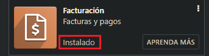

---

## Creación de Usuarios

1. Acceder a la gestión de usuarios:
   - Navegue a **Ajustes** en el menú principal.
   - Desplácese hasta la sección **Opciones Generales**.
   - En el apartado "Usuarios", haga clic en el enlace "Gestionar usuarios".

   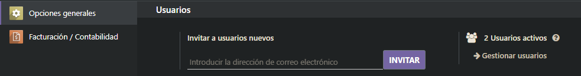

2. Crear un nuevo usuario:
   - En la lista de usuarios, haga clic en el botón "Crear" en la esquina superior izquierda.
   - Complete la información del usuario:
     - Nombre
     - Dirección de correo electrónico
   - Configure los permisos del usuario:
     - En la pestaña **Contabilidad**: Active la casilla "Facturación".
     - En la pestaña **Administración**: Seleccione los "Permisos de acceso" apropiados según el rol del usuario.

   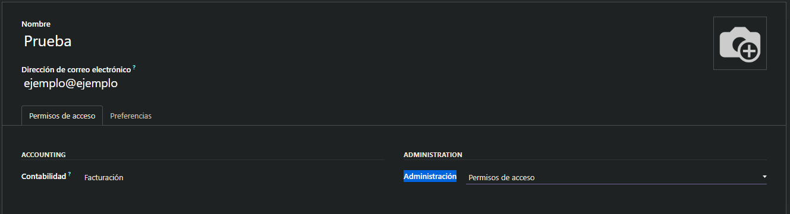

---

## Configuración de Apariencia

1. Cambiar los colores predeterminados:
   - Seleccione la pestaña **Apariencia**.
   - En la sección "Colores", modifique:
     - Color del encabezado: Elija un color para la barra superior.
     - Color del botón: Seleccione un color para los botones principales.

   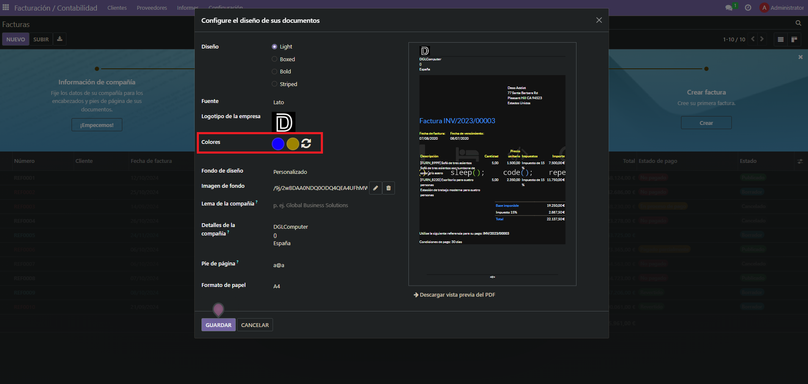

2. Cambiar el logotipo:
   - En la misma sección de Apariencia.
   - Localice la opción "Logotipo".
   - Seleccione "Personalizado" en el menú desplegable.
   - Haga clic en "Subir" y seleccione el archivo de su logotipo.

   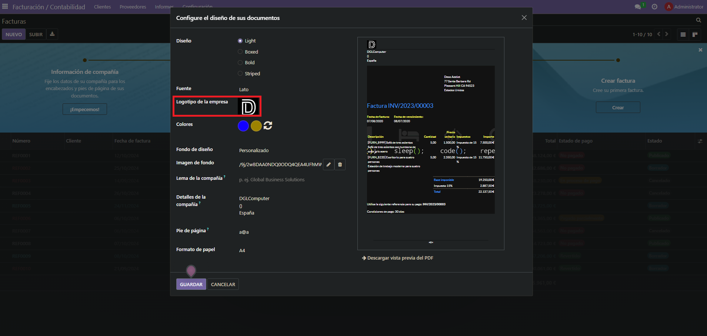

3. Agregar QR de pago a las facturas:
    - Navegue a **Ajustes** en el menú principal.
    - Seleccione **Facturación/Contabilidad** en el panel lateral.
    - Desplácese hasta el apartado **Pago de cliente**.
    - Active la opción **"Códigos QR"**.

    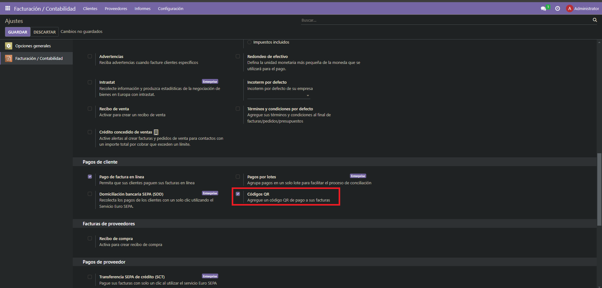

---

## Importación de Clientes

1. Acceder al módulo de Clientes:
   - Vaya al menú **Facturación/Contabilidad**.
   - En el panel lateral, seleccione **Clientes** bajo la sección **Cliente**.

   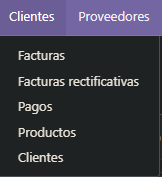

2. Iniciar el proceso de importación:
   - En la vista de lista de clientes, haga clic en el botón "Importar" ubicado en la parte superior de la página.

   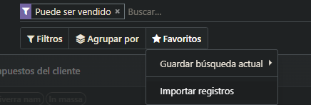

3. Seleccionar y mapear campos:
   - Cargue su archivo CSV con los datos de los clientes.
   - En la pantalla asocie las columnas de su archivo con los campos correspondientes en Odoo.

   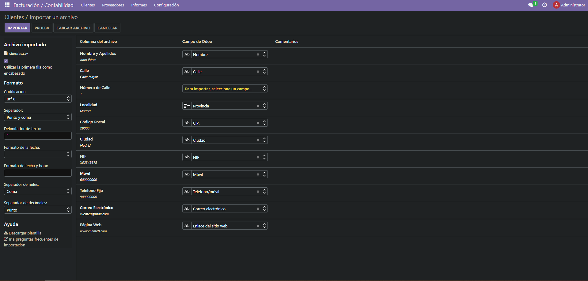

4. Gestionar campos no coincidentes:
   - Si hay campos en su archivo que no tienen una correspondencia directa en Odoo, puede optar por saltarlos.

   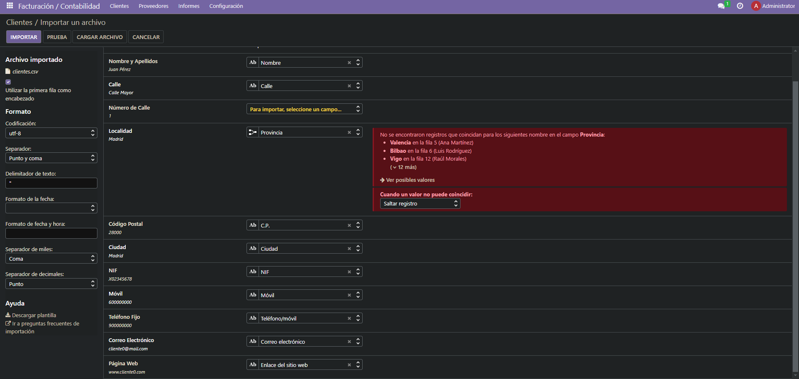

5. Finalizar la importación:
   - Una vez mapeados todos los campos necesarios, haga clic en "Importar" para comenzar el proceso.
   - Revise el informe de importación para asegurarse de que todos los registros se han importado correctamente.
   - Verifique algunos registros impor
   tados para confirmar la precisión de los datos.

---

## Conexión con Otro Usuario

Para conectarse con otro usuario en Odoo, siga estos pasos:

1. Acceda a la página de inicio de sesión de Odoo.
2. Introduzca el correo electrónico del usuario con el que desea conectarse.
3. Ingrese la contraseña correspondiente a ese usuario.
4. Haga clic en el botón "Iniciar sesión" o "Log in".

   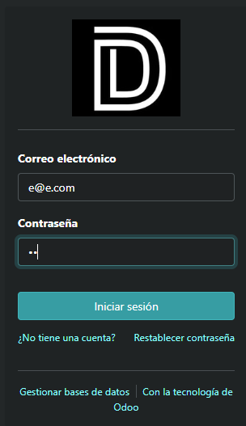
   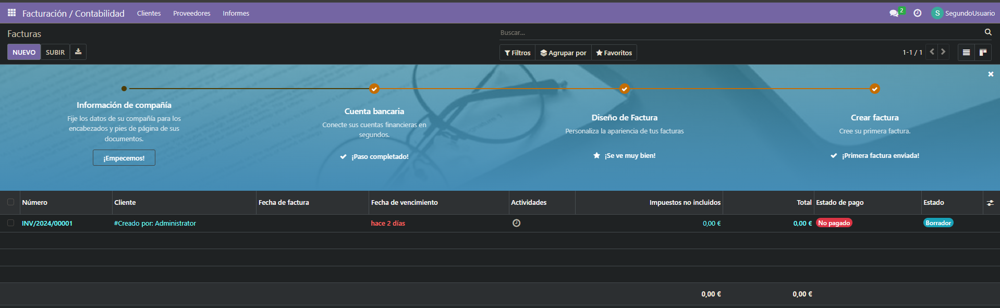

## Informe de Diseño

[Vista Previa del Informe](./Img/Vista%20previa%20del%20diseño%20del%20informe.pdf)
