# EJERCICIO [PR0302]: [Instalación y configuración de un ERP]

## Índice
1. [Activación de Inventario](#activación-de-inventario)
2. [Importación de Productos](#importación-de-productos)
3. [Búsqueda de Imágenes con Google Imágenes](#búsqueda-de-imágenes-con-google-imágenes)
4. [Configurar Odoo para utilizar el buscador](#configurar-odoo-para-utilizar-el-buscador)
4. [Buscar las imagenes del producto](#buscar-las-imágenes-del-producto)

---

## Activación de Inventario

1. Paso 1:
   - Busque "Inventario" en el menú de aplicaciones.
   - Haga clic en el botón "Instalar" o "Activar" junto al módulo de Inventario.
   - Espere a que se complete la instalación. Esto puede tardar unos momentos.
   - Una vez instalado, verifique que el módulo de Inventario aparezca en su lista de aplicaciones activas.

   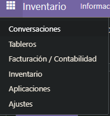
   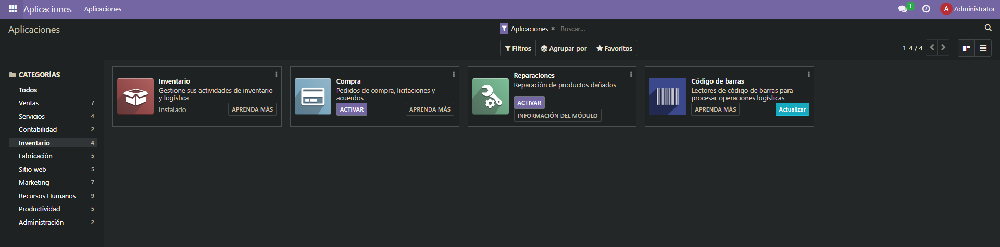

---

## Importacion de Productos

1. Importación de Productos:
   - Acceda al menú de productos.
   - Seleccione la opción "Importar" en favoritos y siga las indicaciones en pantalla.

   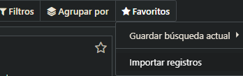

---

## Búsqueda de Imágenes con Google Imágenes

1. Obtenemos una API Key en Google API:
   [vínculo](https://console.cloud.google.com/apis/dashboard)
   - Hay que ir a Google APIs y Servicios.
   - Creamos un nuevo proyecto.

   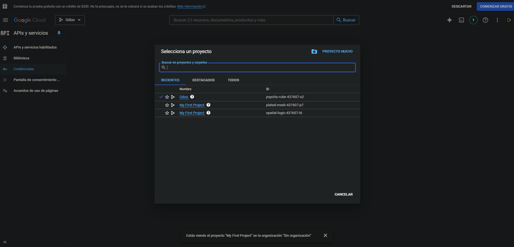
   - Hacer clic en "Crear credenciales".

   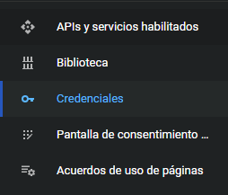
   - Seleccione "Clave de API" y guarde la clave.
   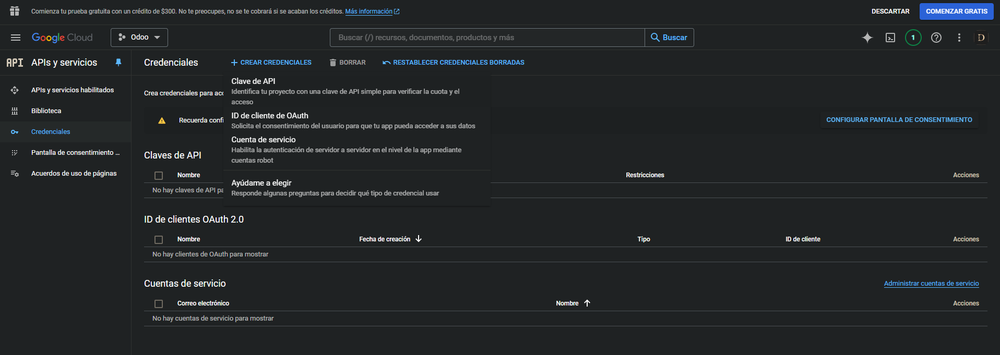

   - Iremos al apartado biblioteca y buscaremos en el buscador Custom Search API.
   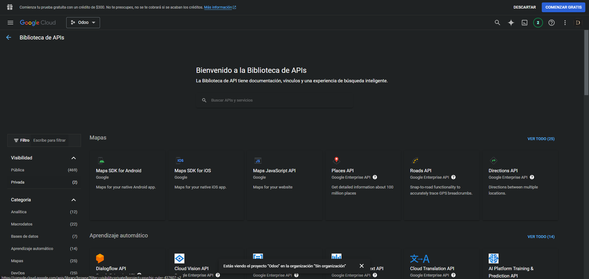

2. Ahora iremos a Google Programmable Search Dashboard:
   [vínculo](https://programmablesearchengine.google.com/)
   - Cree su buscador con el nombre que desee y seleccione búsqueda por imagen y búsqueda segura.
   - Opción B

   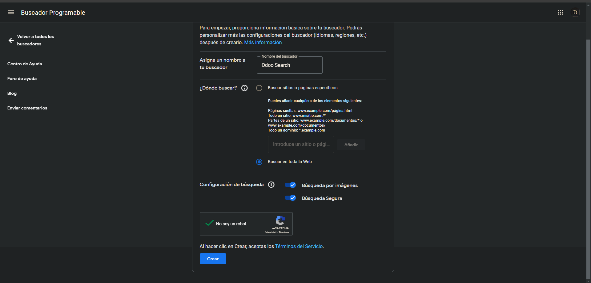
   - Entraremos en personalizar para ver los detalles del buscador y nos quedaremos con el ID de buscador.
   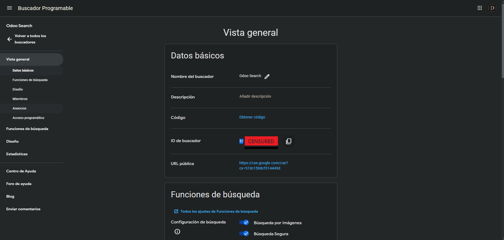

---

## Configurar Odoo para utilizar el buscador

1. Dentro de Odoo:
   - Iremos a ajustes y bajaremos hasta el apartado Integraciones.
   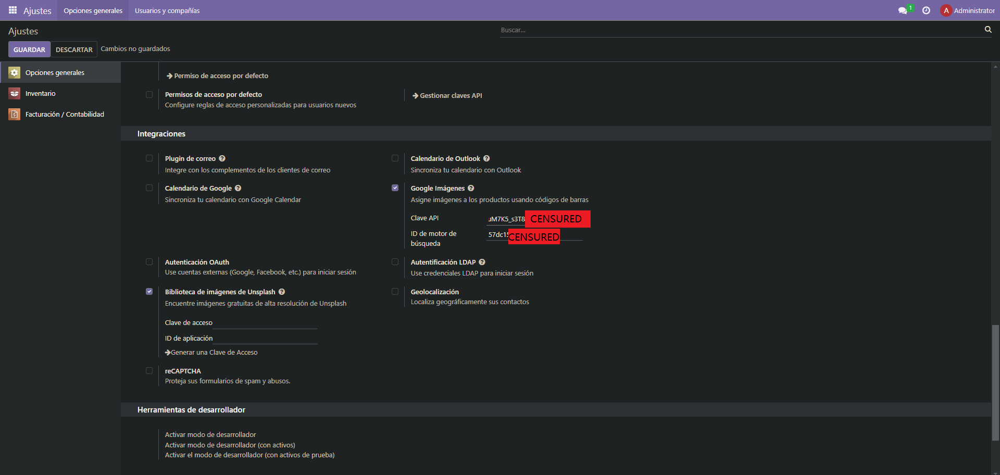

   - Marcamos la casilla Google Imágenes.
   - Después de cargarlo, introduciremos las dos claves que hemos generado anteriormente: API key y la del motor de búsqueda.

---

## Buscar las imágenes del producto

1. Dentro de un producto:
   - Iremos a acciones y elegiremos obtener imágenes de Google Imágenes (si el producto tiene EAN, cargará automáticamente).
   - Subtarea B

   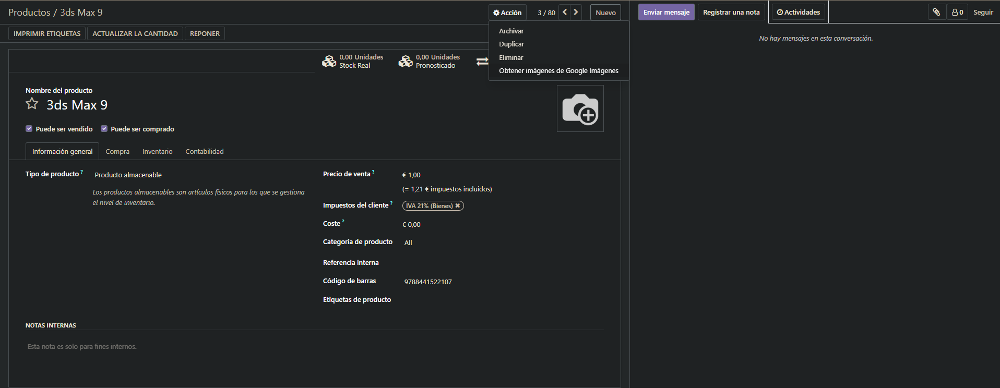
   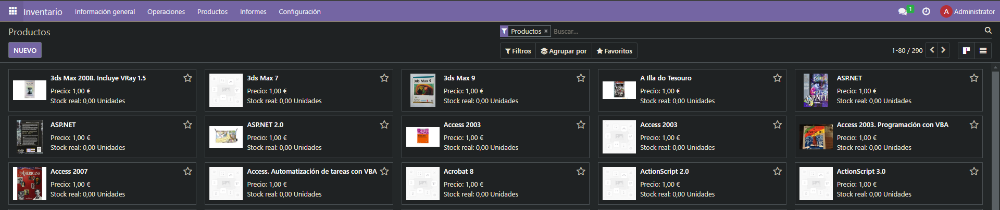

**[← Volver](../index.md)**