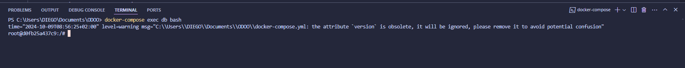
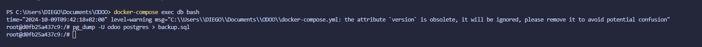
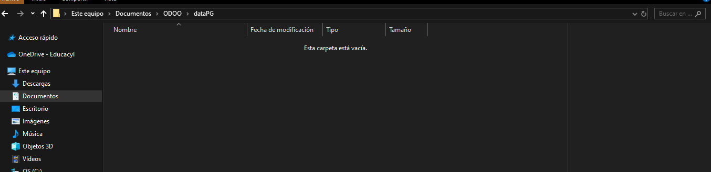

# EJERCICIO [PR0303]: [Copias de seguridad]

## Índice
1. [Sección 1](#sección-1)
2. [Sección 2](#sección-2)
3. [Sección 3](#sección-3)
4. [Sección 4](#sección-4)
5. [Sección 5](#sección-5)

---

## Creación de copia de seguridad

1. Acceder a la terminal del servidor Postgres:
   - Navegaremos a la ruta donde se encuentra el archivo `docker-compose`.
   - Escriba el siguiente comando:
   ```bash
   docker-compose exec db bash
   ```
   - Instrucciones específicas.

   

2. Crear la copia de seguridad con el comando:
   - Utilizando el comando `pg_dump`.
   
   - Podemos comprobar si se ha realizado correctamente usando `ls -l`.
   

3. Extraer el archivo del contenedor:
   - Usando el comando `docker cp db:backup.sql (nombre de la copia) + ruta de destino`.
   

4. Crear la base de datos:
   - Usaremos el comando `createdb -U odoo -O propietario nombre_base`.
   
   - Volcar el contenido de la copia usando el comando `psql -U odoo odoo < backup.sql`.
   

## Creación de nuevo  

1. Borrado de datos:
   - Borramos los datos de las dos carpetas.
   

2. Copiar el archivo del contenedor:
   - Para restaurar la copia, primero debemos copiar el archivo que extrajimos anteriormente, usando `psql -U odoo odoo < backup.sql`.

**[← Volver](../index.md)**