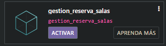
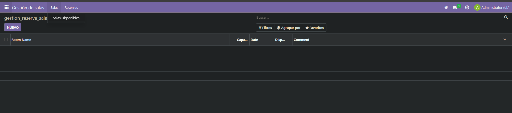
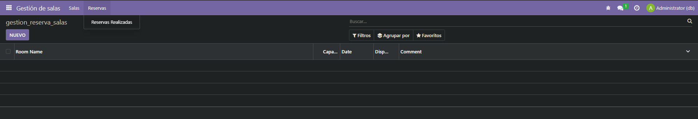

# EJERCICIO [PR0501]: [Primer módulo]

## Índice
1. [Ficheros models.py](#ficheros-modelspy)
2. [Fichero Views.xml](#fichero-viewsxml)
3. [Fichero manifest.py](#fichero-manifestpy)
4. [Captura Resultado](#captura-del-resultado)

---

## _**Ficheros models.py**_
```python
# -*- coding: utf-8 -*-

from odoo import models, fields, api #type:ignore


class gestion_reserva_salas(models.Model):
    _name = 'gestion_reserva_salas.gestion_reserva_salas'
    _description = 'gestion_reserva_salas.gestion_reserva_salas'

    room_name = fields.Char()
    capacity = fields.Integer()
    date = fields.Date()
    reserv =  fields.Boolean("Disponible")
    comment = fields.Text()

```
## _**Fichero Views.xml**_
```xml
<odoo>
  <data>
    <!-- explicit list view definition -->

    <record model="ir.ui.view" id="gestion_reserva_salas.list">
      <field name="name">gestion_reserva_salas list</field>
      <field name="model">gestion_reserva_salas.gestion_reserva_salas</field>
      <field name="arch" type="xml">
        <tree>
          <field name="room_name"/>
          <field name="capacity"/>
          <field name="date"/>
          <field name="reserv"/>
          <field name="comment"/>
        </tree>
      </field>
    </record>


    <!-- actions opening views on models -->

    <record model="ir.actions.act_window" id="gestion_reserva_salas.action_window">
      <field name="name">gestion_reserva_salas</field>
      <field name="res_model">gestion_reserva_salas.gestion_reserva_salas</field>
      <field name="view_mode">tree</field>
    </record>


    <!-- server action to the one above -->
<!--
    <record model="ir.actions.server" id="gestion_reserva_salas.action_server">
      <field name="name">gestion_reserva_salas server</field>
      <field name="model_id" ref="model_gestion_reserva_salas_gestion_reserva_salas"/>
      <field name="state">code</field>
      <field name="code">
        action = {
          "type": "ir.actions.act_window",
          "view_mode": "tree,form",
          "res_model": model._name,
        }
      </field>
    </record>
-->

    <!-- Top menu item -->
    <menuitem name="Gestión de salas" id="gestion_reserva_salas.menu_root"/>

    <!-- menu categories -->
    <menuitem name="Salas" id="gestion_reserva_salas.menu_1" parent="gestion_reserva_salas.menu_root"/>
    
    <menuitem name="Reservas" id="gestion_reserva_salas.menu_2" parent="gestion_reserva_salas.menu_root"/>

    <!-- actions -->

    <menuitem name="Salas Disponibles" id="gestion_reserva_salas.menu_1_list" parent="gestion_reserva_salas.menu_1"
              action="gestion_reserva_salas.action_window"/>
    <menuitem name="Reservas Realizadas" id="gestion_reserva_salas.menu_2_list" parent="gestion_reserva_salas.menu_2"
              action="gestion_reserva_salas.action_window"/>

  </data>
</odoo>
```

## _**Fichero manifest.py**_
```python
# -*- coding: utf-8 -*-

{
    'name': "gestion_reserva_salas",

    'summary': """
        Short (1 phrase/line) summary of the module's purpose, used as
        subtitle on modules listing or apps.openerp.com""",

    'description': """
        Long description of module's purpose
    """,

    'author': "Digule",
    'website': "https://www.yourcompany.com",

    # Categories can be used to filter modules in modules listing
    # Check https://github.com/odoo/odoo/blob/16.0/odoo/addons/base/data/ir_module_category_data.xml
    # for the full list
    'category': 'Uncategorized',
    'version': '0.1',

    # any module necessary for this one to work correctly
    'depends': ['base'],

    # always loaded
    'data': [
        'security/ir.model.access.csv',
        'views/views.xml',
        'views/templates.xml',
    ],
    # only loaded in demonstration mode
    'demo': [
        'demo/demo.xml',
    ],
}

```
## _**Captura del Resultado**_
Activamos nuestro modulo




