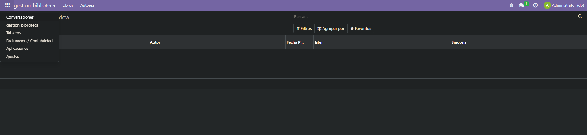

# EJERCICIO [PR0502]: [Módulo con dos modelos]

## Índice
1. [Ficheros models.py](#ficheros-modelspy)
2. [Ficheros Views.xml](#ficheros-viewsxml)
3. [Fichero manifest.py](#fichero-manifestpy)
4. [Fichero ir.model.access](#fichero-irmodelaccess)
5. [Fichero init.py](#fichero-initpy)
6. [Captura del Resultado](#captura-del-resultado)

---

## _**Ficheros models.py**_
Crearemos dos modelos:

**library_author:**
```python
# -*- coding: utf-8 -*-

from odoo import models, fields, api #type:ignore

class library_author(models.Model):
    _name = 'gestion_biblioteca.library_author'
    _description = 'gestion_biblioteca.library_author'

    name = fields.Char()
    fecha_nacimiento = fields.Date()
    biografia = fields.Text()
    libros = fields.Text()
```
**library_book:**
```python
# -*- coding: utf-8 -*-

from odoo import models, fields, api #type:ignore

class library_author(models.Model):
    _name = 'gestion_biblioteca.library_book'
    _description = 'gestion_biblioteca.library_book'

    name = fields.Char()
    autor = fields.Char()
    fecha_publicacion = fields.Date()
    isbn = fields.Char()
    sinopsis = fields.Char()
```
## _**Ficheros Views.xml**_
Utilizaremos 3 views diferentes:

**library_menu_view:**
```xml
<odoo>
  <data>
    <!-- Top menu item -->
    <menuitem name="gestion_biblioteca" id="gestion_biblioteca.menu_root"/>

    <!-- menu categories -->
    <menuitem name="Libros" id="gestion_biblioteca.books" parent="gestion_biblioteca.menu_root"/>
    <menuitem name="Autores" id="gestion_biblioteca.authors" parent="gestion_biblioteca.menu_root"/>

    <menuitem name="Libro" id="gestion_biblioteca.book" parent="gestion_biblioteca.books"
      action="gestion_biblioteca.action_window_library_book"/>
    <menuitem name="Autor" id="gestion_biblioteca.author" parent="gestion_biblioteca.authors"
      action="gestion_biblioteca.action_window_library_author"/>

  </data>
</odoo>
```

**library_author:**
```xml
<odoo>
  <data>
    <!-- explicit list view definition -->

    <record model="ir.ui.view" id="gestion_biblioteca.library_author">
      <field name="name">gestion_biblioteca author</field>
      <field name="model">gestion_biblioteca.library_author</field>
      <field name="arch" type="xml">
        <tree>
          <field name="name"/>
          <field name="fecha_nacimiento"/>
          <field name="biografia"/>
          <field name="libros"/>
        </tree>
      </field>
    </record>
    
    <!-- actions opening views on models -->

    <record model="ir.actions.act_window" id="gestion_biblioteca.action_window_library_author">
      <field name="name">gestion_biblioteca window</field>
      <field name="res_model">gestion_biblioteca.library_author</field>
      <field name="view_mode">tree</field>
    </record>

  </data>
</odoo>
```

**library_book:**
```xml
<odoo>
  <data>
    <!-- explicit list view definition -->

    <record model="ir.ui.view" id="gestion_biblioteca.library_book">
      <field name="name">gestion_biblioteca book</field>
      <field name="model">gestion_biblioteca.library_book</field>
      <field name="arch" type="xml">
        <tree>
          <field name="name"/>
          <field name="autor"/>
          <field name="fecha_publicacion"/>
          <field name="isbn"/>
          <field name="sinopsis"/>
        </tree>
      </field>
    </record>

    <!-- actions opening views on models -->

    <record model="ir.actions.act_window" id="gestion_biblioteca.action_window_library_book">
      <field name="name">gestion_biblioteca window</field>
      <field name="res_model">gestion_biblioteca.library_book</field>
      <field name="view_mode">tree</field>
    </record>

  </data>
</odoo>
```

## _**Fichero manifest.py**_
Añadiremos nuestras tres view previamente creadas, em la lista del campo *__data__*.
```python
# -*- coding: utf-8 -*-
{
    'name': "gestion_biblioteca",

    'summary': """
        Short (1 phrase/line) summary of the module's purpose, used as
        subtitle on modules listing or apps.openerp.com""",

    'description': """
        Long description of module's purpose
    """,

    'author': "My Company",
    'website': "https://www.yourcompany.com",

    # Categories can be used to filter modules in modules listing
    # Check https://github.com/odoo/odoo/blob/16.0/odoo/addons/base/data/ir_module_category_data.xml
    # for the full list
    'category': 'Uncategorized',
    'version': '0.1',

    # any module necessary for this one to work correctly
    'depends': ['base'],

    # always loaded
    'data': [
        'security/ir.model.access.csv',
        'views/library_menu_views.xml',
        'views/library_author.xml',
        'views/library_book.xml',
    ],
    # only loaded in demonstration mode
    'demo': [
        'demo/demo.xml',
    ],
}
```
## _**Fichero ir.model.access**_
Modificaremos nuestro fichero de seguridad.

```csv
id,name,model_id:id,group_id:id,perm_read,perm_write,perm_create,perm_unlink
access_library_author,gestion_biblioteca.library_author,model_gestion_biblioteca_library_author,base.group_user,1,1,1,1
access_library_book,gestion_biblioteca.library_book,model_gestion_biblioteca_library_book,base.group_user,1,1,1,1

```

## _**Fichero init.py**_
Nos eseguraremos de que nuestro fichero init.py de la carpeta *__models__* imporete correctamente nuestos modelos.

```python
# -*- coding: utf-8 -*-

from . import library_author
from . import library_book
```

## _**Captura del Resultado**_




