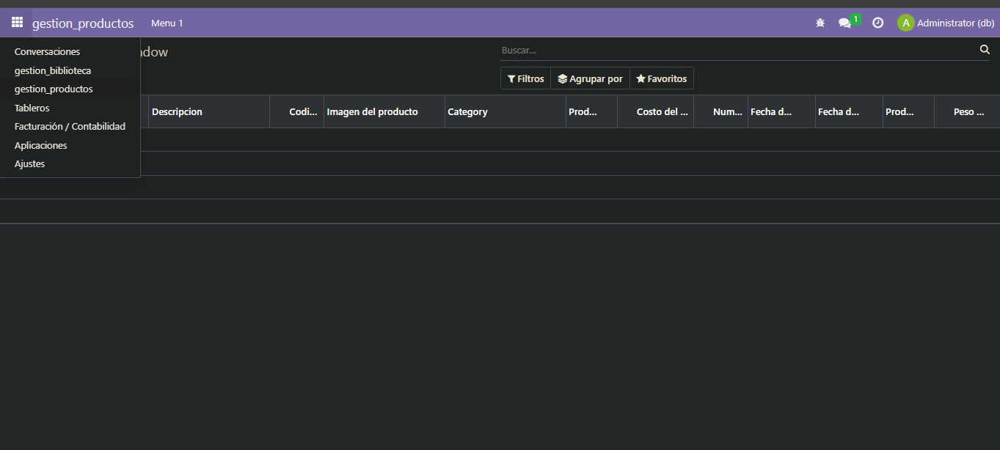

# EJERCICIO [PR0601]: [Campos del modelo]

## Índice
1. [Fichero models.py](#fichero-modelspy)
2. [Fichero views.xml](#fichero-viewsxml)
3. [Fichero manifest.xml](#fichero-manifestxml)
4. [Resultados](#resultado)

---

## _**Fichero models.py**_
```python
# -*- coding: utf-8 -*-

from odoo import models, fields, api #type:ignore


class gestion_productos(models.Model):
    _name = 'gestion_productos.gestion_productos'
    _description = 'gestion_productos.gestion_productos'

    name = fields.Char("Nombre del producto")
    description = fields.Text("Descripcion")
    prod_cod = fields.Integer("Codigo de producto", required=True, help="El codigo es unico y obligatorio")
    image = fields.Image("Imagen del producto")
    # Categoria del producto
    category = fields.Selection(
        [
            ("electrónica", "Electrónica"), 
            ("hogar", "Hogar"), 
            ("ropa", "Ropa")],
            String = "Categoria"
            )
    destacado = fields.Boolean("Producto Destacable", default=False, help="Indica si es un producto destacable o no")
    # Informacion economica
    currency_id = fields.Many2one('res.currency', string='Currency')
    cost = fields.Monetary("Costo del producto", currency_field='currency_id')
    num_available = fields.Integer()
    # Fecha y disponibilidad
    created_date = fields.Date("Fecha de creacion")
    from datetime import date
    created_date = fields.Date("Fecha de creacion", default=date.today)
    last_update_date = fields.Date("Fecha de ultima actualizacion", default=date.today)
    # Informacion adicional
    active = fields.Boolean("Producto Destacable", default=True, help="Indica si es un producto disponible o no")
    prod_weight = fields.Float("Peso del producto", digits=(6, 2))
```
## _**Fichero views.xml**_
``` xml
<odoo>
  <data>
    <!-- explicit list view definition -->

    <record model="ir.ui.view" id="gestion_productos.list">
      <field name="name">gestion_productos list</field>
      <field name="model">gestion_productos.gestion_productos</field>
      <field name="arch" type="xml">
        <tree>
          <field name="name"/>
          <field name="description"/>
          <field name="prod_cod"/>
          <field name="image"/>
          <field name="category"/>
          <field name="destacado"/>
          <field name="cost"/>
          <field name="currency_id" invisible="1"/>
          <field name="num_available"/>
          <field name="created_date"/>
          <field name="last_update_date"/>
          <field name="active"/>
          <field name="prod_weight"/>
        </tree>
      </field>
    </record>


    <!-- actions opening views on models -->

    <record model="ir.actions.act_window" id="gestion_productos.action_window">
      <field name="name">gestion_productos window</field>
      <field name="res_model">gestion_productos.gestion_productos</field>
      <field name="view_mode">tree,form</field>
    </record>


    <!-- server action to the one above -->
<!--
    <record model="ir.actions.server" id="gestion_productos.action_server">
      <field name="name">gestion_productos server</field>
      <field name="model_id" ref="model_gestion_productos_gestion_productos"/>
      <field name="state">code</field>
      <field name="code">
        action = {
          "type": "ir.actions.act_window",
          "view_mode": "tree,form",
          "res_model": model._name,
        }
      </field>
    </record>
-->

    <!-- Top menu item -->

    <menuitem name="gestion_productos" id="gestion_productos.menu_root"/>

    <!-- menu categories -->

    <menuitem name="Menu 1" id="gestion_productos.menu_1" parent="gestion_productos.menu_root"/>

    <!-- actions -->

    <menuitem name="List" id="gestion_productos.menu_1_list" parent="gestion_productos.menu_1"
              action="gestion_productos.action_window"/>
    

  </data>
</odoo>
```
## _**Fichero manifest.xml**_

```python
# -*- coding: utf-8 -*-
{
    'name': "gestion_productos",

    'summary': """
        Short (1 phrase/line) summary of the module's purpose, used as
        subtitle on modules listing or apps.openerp.com""",

    'description': """
        Long description of module's purpose
    """,

    'author': "My Company",
    'website': "https://www.yourcompany.com",

    # Categories can be used to filter modules in modules listing
    # Check https://github.com/odoo/odoo/blob/16.0/odoo/addons/base/data/ir_module_category_data.xml
    # for the full list
    'category': 'Uncategorized',
    'version': '0.1',

    # any module necessary for this one to work correctly
    'depends': ['base'],

    # always loaded
    'data': [
        'security/ir.model.access.csv',
        'views/views.xml',
        'views/templates.xml',
    ],
    # only loaded in demonstration mode
    'demo': [
        'demo/demo.xml',
    ],
}
```
## Resultado

**[← Volver](../index.md)**