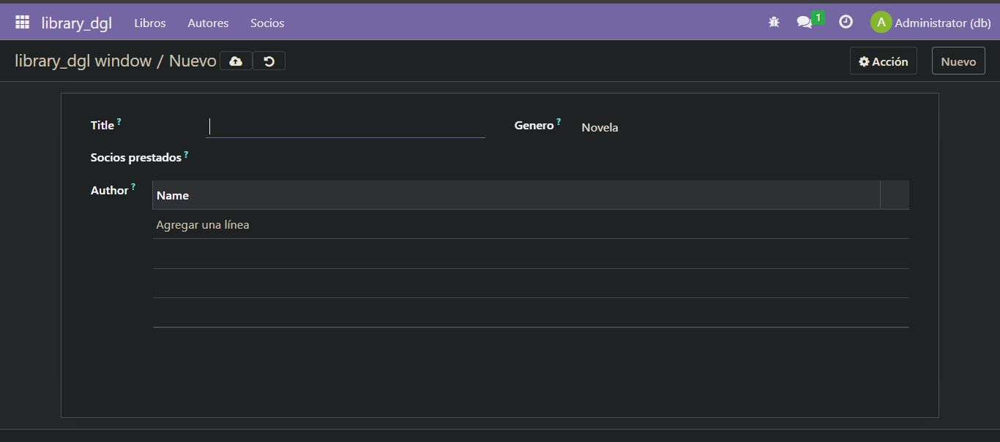
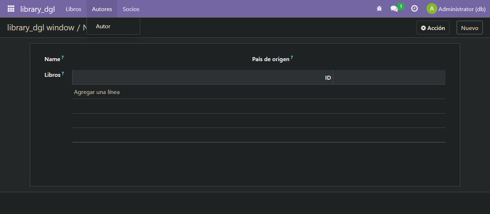
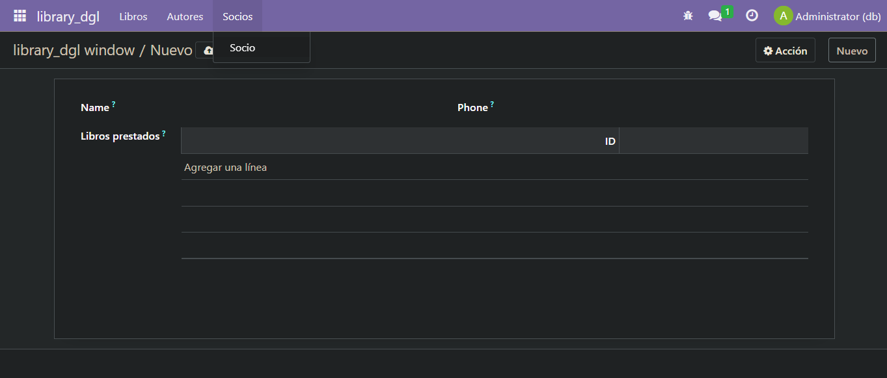

# EJERCICIO [PR0602]: [Campos relacionales]

## Índice
1. [Fichero library_autores.py](#fichero-library_autorespy)
2. [Fichero library_libros.py](#fichero-library_librospy)
3. [Fichero library_socios.py](#fichero-library_sociopy)
4. [Ficheros views](#ficheros-views)
5. [Fichero security](#fichero-security)
6. [Fichero manifest.py](#fichero-manifestpy)
7. [Resultados](#resultado)

---
## _**Ficheros models**_
---

### _**Fichero library_autores.py**_
```python
# -*- coding: utf-8 -*-

from odoo import models, fields, api #type:ignore


class library_autores(models.Model):
    _name = 'library_dgl.library_autores'
    _description = 'library_dgl.library_autores'

    name = fields.Char(String="Nombre")
    country = fields.Many2one('res.country', string="País de origen")
    libros = fields.Many2many(
        comodel_name='library_dgl.library_libros', 
        releation='library_dgl_rel',
        column1='autor_id',
        column2='libro_id'
    )
    
```
### _**Fichero library_libros.py**_
```python
# -*- coding: utf-8 -*-

from odoo import models, fields, api #type:ignore


class library_libros(models.Model):
    _name = 'library_dgl.library_libros'
    _description = 'library_dgl.library_libros'

    title = fields.Char(String="Titulo")
    # author = fields.Char(String="Autor")
    genero = fields.Selection(
        [
            ('novela','Novela'),
            ('drama','Drama'),
            ('ciencia_ficcion','Ciencia ficcion'),
            ('misterio','Misterio'),
            ('terror','Terror'),
            ('historico','Historico')
            
        ],
        String="Genero",
        default='novela'
    )
    prestados = fields.Many2one(
        comodel_name='library_dgl.library_socios',
        string = 'Socios prestados'
    )

    author = fields.Many2many(
        comodel_name='library_dgl.library_autores',
        releation='library_dgl_rel',
        column1='libro_id',
        column2='autor_id'
    )
```
### _**Fichero library_socios.py**_
```python
# -*- coding: utf-8 -*-

from odoo import models, fields, api #type:ignore


class library_socios(models.Model):
    _name = 'library_dgl.library_socios'
    _description = 'library_dgl.library_socios'

    name = fields.Char(String="Nombre")
    phone = fields.Char(String="Telefono" )
    libros_prestados = fields.One2many(
        comodel_name = 'library_dgl.library_libros',
        inverse_name='prestados',
        string = 'Libros prestados'
    )
```

## _**Fichero security**_
---

### _**Fichero ir.model.access.csv**_
```csv
id,name,model_id:id,group_id:id,perm_read,perm_write,perm_create,perm_unlink
access_library_autores,library_dgl.library_autores,model_library_dgl_library_autores,base.group_user,1,1,1,1
access_library_libros,library_dgl.library_libros,model_library_dgl_library_libros,base.group_user,1,1,1,1
access_library_socios,library_dgl.library_socios,model_library_dgl_library_socios,base.group_user,1,1,1,1
```

## _**Ficheros views**_
---

### _**Fichero library_autores.xml**_
```xml
<odoo>
  <data>
    <!-- explicit list view definition -->

    <record model="ir.ui.view" id="library_dgl.list">
      <field name="name">library_dgl autores</field>
      <field name="model">library_dgl.library_autores</field>
      <field name="arch" type="xml">
        <tree>
          <field name="name"/>
          <field name="country"/>
          <field name="libros"/>
        </tree>
      </field>
    </record>


    <!-- actions opening views on models -->

    <record model="ir.actions.act_window" id="library_dgl.action_window_library_autores">
      <field name="name">library_dgl window</field>
      <field name="res_model">library_dgl.library_autores</field>
      <field name="view_mode">tree,form</field>
    </record>

  </data>
</odoo>
```
### _**Fichero library_libros.xml**_
```xml
<odoo>
  <data>
    <!-- explicit list view definition -->

    <record model="ir.ui.view" id="library_dgl.list">
      <field name="name">library_dgl libros</field>
      <field name="model">library_dgl.library_libros</field>
      <field name="arch" type="xml">
        <tree>
          <field name="title"/>
          <field name="author"/>
          <field name="genero"/>
          <field name="prestados"/>
        </tree>
      </field>
    </record>


    <!-- actions opening views on models -->

    <record model="ir.actions.act_window" id="library_dgl.action_window_library_libros">
      <field name="name">library_dgl window</field>
      <field name="res_model">library_dgl.library_libros</field>
      <field name="view_mode">tree,form</field>
    </record>
  </data>
</odoo>
```
### _**Fichero library_menu.xml**_
```xml
<odoo>
  <data>
    

    <!-- Top menu item -->
    <menuitem name="library_dgl" id="library_dgl.menu_root"/>
    <!-- menu categories -->
    <menuitem name="Libros" id="library_dgl.libros_menu1" parent="library_dgl.menu_root"/>
    <menuitem name="Autores" id="library_dgl.autores_menu1" parent="library_dgl.menu_root"/>
    <menuitem name="Socios" id="library_dgl.socios_menu1" parent="library_dgl.menu_root"/>
    <!-- actions -->
    <menuitem name="Libro" id="library_dgl.libro_menu2" parent="library_dgl.libros_menu1"
              action="library_dgl.action_window_library_libros"/>
    <menuitem name="Autor" id="library_dgl.autor_menu2" parent="library_dgl.autores_menu1"
              action="library_dgl.action_window_library_autores"/>
    <menuitem name="Socio" id="library_dgl.socio_menu2" parent="library_dgl.socios_menu1"
              action="library_dgl.action_window_library_socios"/>
  </data>
</odoo>
```
### _**Fichero library_socios.xml**_
```xml
<odoo>
  <data>
    <!-- explicit list view definition -->

    <record model="ir.ui.view" id="library_dgl.list">
      <field name="name">library_dgl socios</field>
      <field name="model">library_dgl.library_socios</field>
      <field name="arch" type="xml">
        <tree>
          <field name="name"/>
          <field name="phone"/>
          <field name="libros_prestados"/>
        </tree>
      </field>
    </record>


    <!-- actions opening views on models -->

    <record model="ir.actions.act_window" id="library_dgl.action_window_library_socios">
      <field name="name">library_dgl window</field>
      <field name="res_model">library_dgl.library_socios</field>
      <field name="view_mode">tree,form</field>
    </record>

  </data>
</odoo>
```
## _**Fichero manifest.py**_
```python
# -*- coding: utf-8 -*-
{
    'name': "library_dgl",

    'summary': """
        Short (1 phrase/line) summary of the module's purpose, used as
        subtitle on modules listing or apps.openerp.com""",

    'description': """
        Long description of module's purpose
    """,

    'author': "My Company",
    'website': "https://www.yourcompany.com",

    # Categories can be used to filter modules in modules listing
    # Check https://github.com/odoo/odoo/blob/16.0/odoo/addons/base/data/ir_module_category_data.xml
    # for the full list
    'category': 'Uncategorized',
    'version': '0.1',

    # any module necessary for this one to work correctly
    'depends': ['base'],

    # always loaded
    'data': [
        'security/ir.model.access.csv',
        'views/library_autores.xml',
        'views/library_libros.xml',
        'views/library_socios.xml',
        'views/library_menu.xml'
    ],
    # only loaded in demonstration mode
    'demo': [
        'demo/demo.xml',
    ],
}

```

## Resultado



**[← Volver](../index.md)**