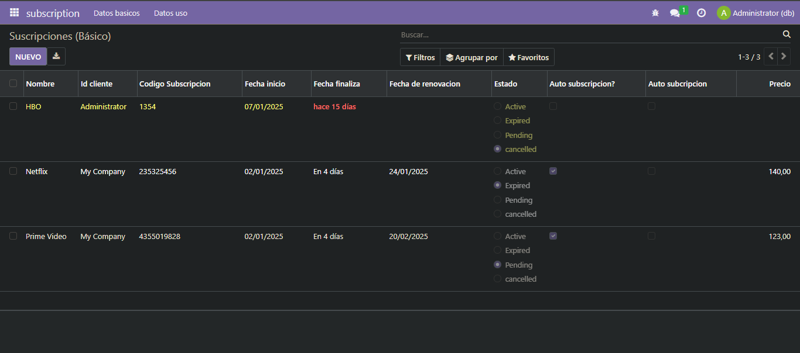
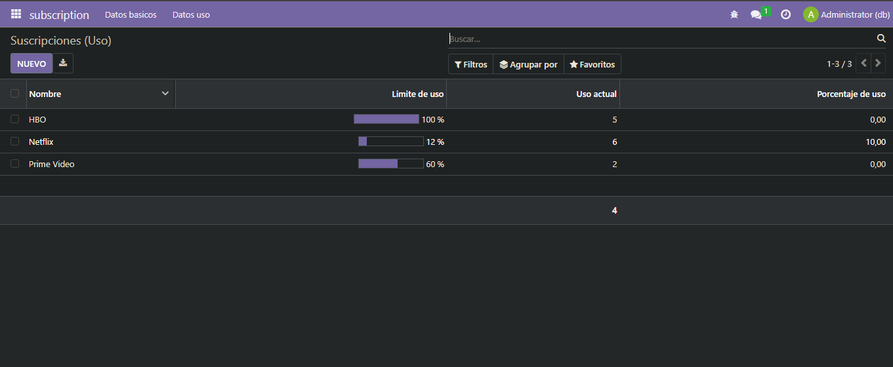

# EJERCICIO [PR0604]: [Vista de tipo lista]

## Índice
1. [Fichero models.py](#fichero-modelspy)
1. [Fichero security.csv](#fichero-irmodelaccesscsv)
3. [Fichero manifest.xml](#fichero-manifestxml)
2. [Fichero views.xml](#fichero-viewsxml)
4. [Resultados](#resultado)

---
Crearemos nuestro modelo segun las caracteristicas del ejercicio
## _**Fichero models.py**_
```python
# -*- coding: utf-8 -*-

from odoo import models, fields, api #type:ignore


class subscription(models.Model):
    _name = 'subscription.subscription'
    _description = 'subscription.subscription'
    _sql_constaints=[('unique_name','unique(name)','El nombre debe ser unico'),
                     ('unique_name','unique(subscription_code)','El codigo de subscripcion debe ser unico')]

    name = fields.Char(string='Nombre', required=True)
    customer_id = fields.Many2one(
        comodel_name='res.partner',
        required=True)
    subscription_code = fields.Char(string='Codigo de Subscripcion',required=True)
    start_date = fields.Date(string='fecha de inicio',required=True)
    end_date = fields.Date('fecha de fin')
    renewal_date  = fields.Date('Fecha en la que la subscripcion se renovara')
    status = fields.Selection([
        ('active', 'Active'),
        ('expired','Expired'),
        ('pending','Pending'),
        ('cancelled','cancelled')
    ], string='status')
    is_renewable  = fields.Boolean('Se puede renovar automaticamente?')
    auto_renewal = fields.Boolean('Si está activada')
    price = fields.Float('Precio')
    usage_limit = fields.Integer('Número máximo de usos')
    current_usage = fields.Integer('Cantidad de servicios utilizados')
    use_percent = fields.Float(string='porcentaje usado', calc = "calc_percent")


    @api.depends('usage_limit','current_usage')
    def calc_percent(self):
        for record in self:
            record.use_percent = (record.current_usage / record.use_limite) * 100
```
Nos aseguraremso de configurar el accesoa nuestro fichero de modelos
## _**Fichero ir.model.access.csv**_

```csv
id,name,model_id:id,group_id:id,perm_read,perm_write,perm_create,perm_unlink
access_subscription_subscription,subscription.subscription,model_subscription_subscription,base.group_user,1,1,1,1
```


## _**Fichero manifest.xml**_

```python
# -*- coding: utf-8 -*-
{
    'name': "subscription",

    'summary': """
        Short (1 phrase/line) summary of the module's purpose, used as
        subtitle on modules listing or apps.openerp.com""",

    'description': """
        Long description of module's purpose
    """,

    'author': "My Company",
    'website': "https://www.yourcompany.com",

    # Categories can be used to filter modules in modules listing
    # Check https://github.com/odoo/odoo/blob/16.0/odoo/addons/base/data/ir_module_category_data.xml
    # for the full list
    'category': 'Uncategorized',
    'version': '0.1',

    # any module necessary for this one to work correctly
    'depends': ['base'],

    # always loaded
    'data': [
        'security/ir.model.access.csv',
        'views/subscription_views.xml',
        'views/static_web.xml',
        'views/dinamic_web.xml',
    ],
    # only loaded in demonstration mode
    'demo': [
        'demo/demo.xml',
    ],
}
```

Crearemos dos vistas de tipo arbol (tree) sobre el mismo modelo:
## _**Fichero views.xml**_

```xml
<odoo>
  <data>
    <!-- explicit list view definition -->

    <record id="view_subscription_tree_basic" model="ir.ui.view">
      <field name="name">subscription list</field>
      <field name="model">subscription.subscription</field>
      <field name="arch" type="xml">
        <tree decoration-danger="status=='expired'" decoration-warning="status=='cancelled'" limit="15">
          <field name="name" string="Nombre"/>
          <field name="customer_id" string="Id cliente"/>
          <field name="subscription_code" string="Codigo Subscripcion"/>
          <field name="start_date" string="Fecha inicio"/>
          <field name="end_date" string="Fecha finaliza" widget="remaining_days"/>
          <field name="renewal_date" string="Fecha de renovacion"/>
          <field name="status" string="Estado" widget="radio"/>
          <field name="is_renewable" string="Auto subscripcion?"/>
          <field name="auto_renewal" string="Auto subcripcion"/>
          <field name="price" string="Precio" attrs="{'invisible':[('status','=','cancelled')]}"/>
        </tree>
      </field>
    </record>

    <record id="view_subscription_tree_usage" model="ir.ui.view">
      <field name="name">subscription list</field>
      <field name="model">subscription.subscription</field>
      <field name="arch" type="xml">
        <tree limit="15">
          <field name="name" string="Nombre"/>
          <field name="usage_limit" string="Limite de uso" widget="progressbar"/>
          <field name="current_usage" string="Uso actual" avg="1"/>
          <field name="use_percent" string="Porcentaje de uso" decoration-danger="use_percent >=  80"/>
        </tree>
      </field>
    </record>

    <!-- actions opening views on models -->

    <record id="action_subscription_basic" model="ir.actions.act_window">
        <field name="name">Suscripciones (Básico)</field>
        <field name="res_model">subscription.subscription</field>
        <field name="view_mode">tree,form</field>
        <field name="view_id" ref="view_subscription_tree_basic"/>
    </record>

    <record id="action_subscription_usage" model="ir.actions.act_window">
        <field name="name">Suscripciones (Uso)</field>
        <field name="res_model">subscription.subscription</field>
        <field name="view_mode">tree,form</field>
        <field name="view_id" ref="view_subscription_tree_usage"/>
    </record>


    <!-- server action to the one above -->
<!--
    <record model="ir.actions.server" id="subscription.action_server">
      <field name="name">subscription server</field>
      <field name="model_id" ref="model_subscription_subscription"/>
      <field name="state">code</field>
      <field name="code">
        action = {
          "type": "ir.actions.act_window",
          "view_mode": "tree,form",
          "res_model": model._name,
        }
      </field>
    </record>
-->

    <!-- Top menu item -->

    <menuitem name="subscription" id="subscription.menu_root"/>

    <!-- menu categories -->

    <menuitem name="Datos basicos" id="subscription.menu_1" parent="subscription.menu_root"/>
    <menuitem name="Datos uso" id="subscription.menu_2" parent="subscription.menu_root"/>

    <!-- actions -->

    <menuitem name="Basicos" id="subscription.menu_1_list" parent="subscription.menu_1"
              action="action_subscription_basic"/>
    <menuitem name="Uso" id="subscription.menu_2_list" parent="subscription.menu_2"
              action="action_subscription_usage"/>

  </data>
</odoo>
```
## Resultado


**[← Volver](../index.md)**