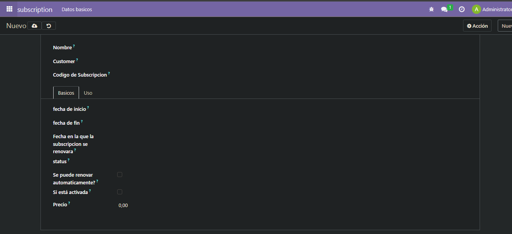
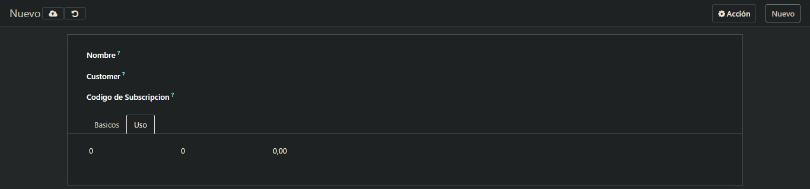

# EJERCICIO [PR0605 ]: [Vista de tipo formulario]

## Índice
1. [Fichero views.xml](#fichero-viewsxml)
2. [Resultados](#resultado)

---

Utilizando el restos de ficheros del modelo anterior solo modificatemos la vista para conseguir una vista formulario(form)
## _**Fichero views.xml**_

```xml
<odoo>
  <data>
    <!-- explicit list view definition -->
    <record id="view_subscription_tree_basic_view_form" model="ir.ui.view">
      <field name="name">subscription form</field>
      <field name="model">subscription.subscription</field>
      <field name="arch" type="xml">
        <form>
          <sheet>
            <group>
              <field name="name"/>
              <field name="customer_id" />
              <field name="subscription_code"/>
            </group>
            <notebook>
              <page string="Basicos">
                <group>
                  <field name="start_date"/>
                  <field name="end_date" />
                  <field name="renewal_date" />
                  <field name="status" />
                  <field name="is_renewable" />
                  <field name="auto_renewal" />
                  <field name="price" />
                </group>
              </page>
              <page string="Uso">
                <field name="usage_limit" />
                <field name="current_usage" />
                <field name="use_percent" />
              </page>
            </notebook>
          </sheet>
        </form>
      </field>
    </record>
    <!-- actions opening views on models -->

    <record id="action_subscription_basic" model="ir.actions.act_window">
        <field name="name">Suscripciones (Básico)</field>
        <field name="res_model">subscription.subscription</field>
        <field name="view_mode">tree,form</field>
        <field name="view_id" ref="view_subscription_tree_basic_view_form"/>
    </record>


    <!-- server action to the one above -->
<!--
    <record model="ir.actions.server" id="subscription.action_server">
      <field name="name">subscription server</field>
      <field name="model_id" ref="model_subscription_subscription"/>
      <field name="state">code</field>
      <field name="code">
        action = {
          "type": "ir.actions.act_window",
          "view_mode": "tree,form",
          "res_model": model._name,
        }
      </field>
    </record>
-->

    <!-- Top menu item -->

    <menuitem name="subscription" id="subscription.menu_root"/>

    <!-- menu categories -->

    <menuitem name="Datos basicos" id="subscription.menu_1" parent="subscription.menu_root"/>

    <!-- actions -->

    <menuitem name="Basicos" id="subscription.menu_1_list" parent="subscription.menu_1"
              action="action_subscription_basic"/>

  </data>
</odoo>
```
## Resultado


**[← Volver](../index.md)**