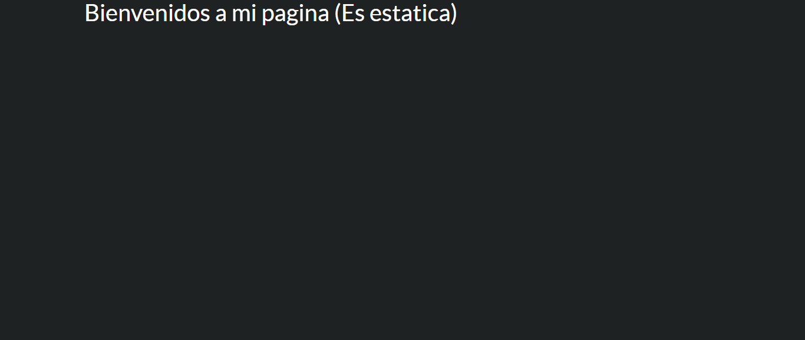
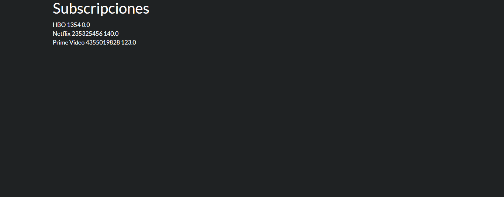

# EJERCICIO [PR0701]: [Página estática y dinámica básica]

## Índice
1. [Fichero models.py](#fichero-modelspy)
1. [Fichero security.csv](#fichero-irmodelaccesscsv)
3. [Fichero manifest.xml](#fichero-manifestxml)
2. [Fichero views.xml](#fichero-viewsxml)
4. [Resultados](#resultado)

---
Usaremos el mismo modulo de subscription
En el manifest pondremos las dos views de las paginas
## _**Fichero manifest.xml**_

```python
# -*- coding: utf-8 -*-
{
    'name': "subscription",

    'summary': """
        Short (1 phrase/line) summary of the module's purpose, used as
        subtitle on modules listing or apps.openerp.com""",

    'description': """
        Long description of module's purpose
    """,

    'author': "My Company",
    'website': "https://www.yourcompany.com",

    # Categories can be used to filter modules in modules listing
    # Check https://github.com/odoo/odoo/blob/16.0/odoo/addons/base/data/ir_module_category_data.xml
    # for the full list
    'category': 'Uncategorized',
    'version': '0.1',

    # any module necessary for this one to work correctly
    'depends': ['base'],

    # always loaded
    'data': [
        'security/ir.model.access.csv',
        'views/subscription_views.xml',
        'views/static_web.xml',
        'views/dinamic_web.xml',
    ],
    # only loaded in demonstration mode
    'demo': [
        'demo/demo.xml',
    ],
}

```

Crearemos dos vistas de tipo arbol (tree) sobre el mismo modelo:
## _**Fichero views.xml (Web statica)**_

```xml
<odoo>
    <template id="static_web" name="Mi pagina statica">
        <t t-call="web.html_container">
            <div class="container">
                <h1>Bienvenidos a mi pagina (Es estatica)</h1>
            </div>
        </t>
    </template>
</odoo>
```
## _**Fichero views.xml (Web dianmica)**_

```xml
<odoo>
    <template id="dinamic_web">
        <t t-call="web.html_container">
            <div class="container">
                <h1>Subscripciones</h1>
                <t t-foreach="subscrip" t-as="sub">
                    <div>
                        <span><t t-esc="sub.name"/></span>
                        <span><t t-esc="sub.subscription_code"/></span>
                        <span><t t-esc="sub.price"/></span>
                    </div>
                </t>
            </div>
        </t>
    </template>
</odoo>
```

## _**Fichero controllers.py**_
```python
# -*- coding: utf-8 -*-
from odoo import http #type:ignore


class Subscription(http.Controller):
    @http.route('/subscription/subscription', auth='public', website="True")
    def index(self, **kw):
        return http.request.render('subscription.static_web',{})

    @http.route('/subscription/list', auth='public', website=True)
    def list(self, **kw):
        sub = http.request.env['subscription.subscription'].search([])
        return http.request.render('subscription.dinamic_web',{
            'subscrip':sub
        })
        
```

## Resultado


**[← Volver](../index.md)**